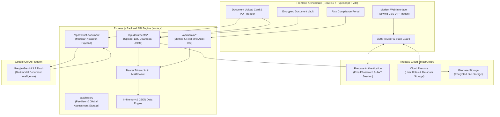

# FinGuard 🛡️ — AI-Powered Financial Decision-Safety & Risk Prevention Platform

> **Empowering users and organizations with real-time financial transaction safety, intelligent document extraction, decision friction pause checklists, and compliance audit controls.**


---

## 📌 Executive Summary

Financial fraud, social engineering scams, urgent phishing invoices, and unauthorized payment channels result in billions of dollars in losses annually. Standard banking apps focus on transaction execution, but lack **pre-transaction decision safety friction**.

**FinGuard** bridges this critical gap by acting as an intelligent pre-payment decision assistant. It analyzes invoices, payment requests, and recipient details using **Google Gemini 3.7 Flash AI**, detects subtle scam/urgency patterns, computes a dynamic multi-factor Safety Score, and enforces a mandatory **Safety Pause Checklist** before money leaves the user's account.

---

## 🎯 Problem vs. Solution

| The Problem ❌ | The FinGuard Solution Brought to Life 🛡️ |
| :--- | :--- |
| **High Emotional Urgency**: Fraudsters pressure victims with immediate countdown timers and panic language. | **Automated Urgency Extraction**: Gemini AI parses documents for forced deadline pressure and flags psychological risk signals. |
| **Unfamiliar Payment Routes**: Fake QR codes, personal UPI handles for corporate billing, or unverified bank accounts. | **Unusual Method Flags**: FinGuard cross-evaluates payee channels, payment instructions, and recipient novelty. |
| **Silent Mistakes**: Users click "Send" without reflecting on key verification steps. | **Mandatory Safety Pause**: Enforces a decision-friction checklist before final acknowledgment. |
| **No Audit Visibility**: Compliance officers have zero visibility into personal or organizational high-risk transfers. | **Compliance & Risk Control Portal**: Real-time audit logs, risk distribution metrics, and global document monitoring. |

---

## 🏗️ System Architecture



---

## ✨ Key Features

### 1. 🤖 Gemini AI Document Extraction
- Upload invoices, bills, QR screenshots, or payment requests (PDF, JPG, PNG, WEBP up to 20MB).
- Automatically extracts **Amount**, **Payee Name**, **Payment Instructions**, **Urgency Phrasing**, and **Unusual Payment Routes**.

### 2. 🧮 Dynamic Safety Score Engine
- Evaluates 5 distinct risk categories:
  - **Amount Magnitude Risk** (High-value payment thresholds)
  - **Recipient Novelty** (First-time vs. recurring payee verification)
  - **Psychological Time Pressure** (Urgency, immediate cutoff threats)
  - **Payment Channel Anomaly** (Crypto, personal UPI, gift card requests)
  - **Document Structuring Integrity**
- Output: Numerical Safety Score (0–100) classified into **LOW**, **REVIEW**, or **HIGH** risk levels.

### 3. ⏸️ Mandatory Safety Pause & Verification Checklist
- When a payment exhibits risk factors, FinGuard renders a mandatory **Safety Pause Screen**.
- Guides users through a multi-point verification checklist (Voice call confirmation, official channel double-check, invoice verification) before recording acknowledgment.

### 4. 📁 Encrypted Private Document Vault
- Users can view, search, filter, and download their parsed payment documents.
- Strict ownership authorization prevents unauthenticated or cross-tenant document access.

### 5. 👑 Role-Based Access Control (RBAC) & Admin Portal
- Supports **User** and **Admin (Risk Officer)** roles.
- **Admin Dashboard**: System-wide risk metrics, high-risk flagged counts, real-time audit logs, and global vault audit controls.

---

## 🔐 Security & Permission Model

| Resource / Action | Unauthenticated Guest | Regular User (`user`) | Compliance Admin (`admin`) |
| :--- | :---: | :---: | :---: |
| **View Home & How It Works** | ✅ Allowed | ✅ Allowed | ✅ Allowed |
| **Check Payment & AI Document Parsing** | 🔒 Auth Required | ✅ Allowed | ✅ Allowed |
| **Access Private Document Vault** | ❌ Blocked | ✅ Private Own Docs | ✅ Full Access |
| **Download Stored Documents** | ❌ Blocked | ✅ Private Own Docs | ✅ Global Access |
| **Access Admin Risk Portal (`/admin`)** | ❌ Blocked | 🚫 **403 Forbidden** | ✅ Full Access |
| **View System Audit Logs** | ❌ Blocked | 🚫 **403 Forbidden** | ✅ Full Access |

---

## ⚡ Tech Stack

- **Frontend Core**: React 19, TypeScript 5.8, Vite 6
- **Styling**: Tailwind CSS v4, Motion, Lucide React Icons
- **Backend Server**: Node.js, Express.js 4.21, tsx / esbuild
- **Authentication**: Firebase Authentication (SDK v11) with local token session fallback
- **Database & Storage**: Firebase Firestore, Firebase Storage & Express In-Memory JSON store
- **AI Processing**: `@google/genai` (Google Gemini 3.7 Flash Model)

---

## 🚀 Quick Start Guide

### Prerequisites
- **Node.js**: v18.0.0 or higher
- **npm**: v9.0.0 or higher

### Installation

1. **Clone the Repository**:
   ```bash
   git clone https://github.com/NEXORA1425/FinGuard.git
   cd FinGuard
   ```

2. **Install Dependencies**:
   ```bash
   npm install
   ```

3. **Configure Environment Variables**:
   Create a `.env` file in the root directory (or copy `.env.example`):
   ```env
   GEMINI_API_KEY="your_google_gemini_api_key"
   ```

4. **Run Development Server**:
   ```bash
   npm run dev
   ```
   Open your browser and navigate to `http://localhost:3000`.

5. **Build for Production**:
   ```bash
   npm run build
   npm start
   ```

---

## 🔑 Demo Credentials (For Hackathon Judges)

You can use the pre-configured quick demo presets on the Sign In page or log in with:

| Role | Email Address | Password | Privileges |
| :--- | :--- | :--- | :--- |
| **Regular User** | `user@finguard.com` | `User123!` | Payment safety check, private history, personal document vault |
| **Compliance Admin** | `admin@finguard.com` | `Admin123!` | System metrics, high-risk flags, security audit logs, global vault |

---

## 📡 API Reference

### Authentication Endpoints
- `POST /api/auth/signup` - Register a new user account with role selection.
- `POST /api/auth/login` - Authenticate user & issue session token.
- `GET /api/auth/me` - Fetch current user profile.
- `POST /api/auth/logout` - Invalidate active session.

### Document & AI Processing Endpoints
- `POST /api/extract-document` - Extract payment fields using Gemini AI.
- `POST /api/documents/upload` - Securely store document binary, metadata & extraction payload.
- `GET /api/documents` - Retrieve documents for current user (or all if admin).
- `GET /api/documents/:id/download` - Download raw document binary (Ownership verified).
- `DELETE /api/documents/:id` - Delete document record.

### History & Admin Endpoints
- `GET /api/history` - Fetch safety evaluations.
- `POST /api/history` - Persist new safety assessment.
- `GET /api/admin/metrics` - Fetch platform-wide safety distribution metrics (Admin only).
- `GET /api/admin/audit-logs` - Retrieve real-time security audit logs (Admin only).

---

## 📄 License

Distributed under the MIT License. See `LICENSE` for more information.

---

<p align="center">
  Made with ❤️ for <strong>Hackathon 2026</strong> | FinGuard Decision Safety Systems
</p>
